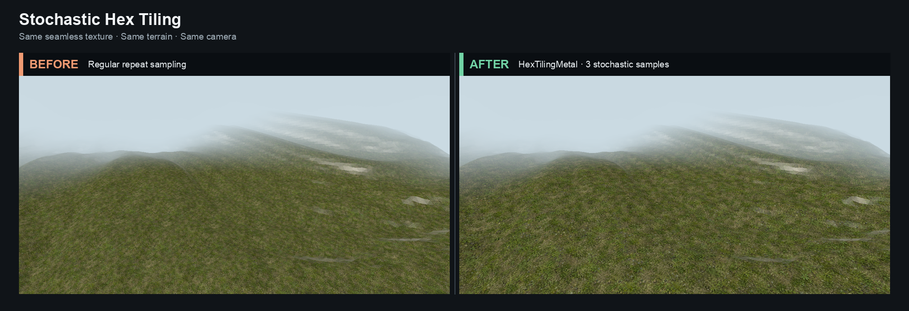

# metal-hex-tiling

A small, Metal-only Swift package for stochastic, non-repeating texture tiling on Apple GPUs.

[Project page](https://crapthings.github.io/metal-hex-tiling/) · [Algorithm and architecture](Documentation/Architecture.md)

It ports the shader algorithm used by [`three-hex-tiling`](https://github.com/ameobea/three-hex-tiling): a seamless source texture is sampled at up to three deterministic random offsets and blended over a triangular/hexagonal lattice. The result suppresses obvious periodic repetition without generating or storing a larger texture.




The comparison uses the same seamless texture, terrain, camera, lighting, and UV scale. Only the texture sampling method changes: regular repeat sampling on the left, `HexTilingMetal` with up to three stochastic samples on the right.

## Requirements

- macOS 13 or newer
- Swift 6 toolchain
- A Metal-capable GPU

The library depends on Metal, not MetalKit. It works with `MTKView`, `CAMetalLayer`, and offscreen renderers.

## Installation

Add this package to `Package.swift`:

```swift
dependencies: [
    .package(url: "https://github.com/crapthings/metal-hex-tiling.git", from: "0.1.0")
]
```

Then add `.product(name: "MetalHexTiling", package: "metal-hex-tiling")` to your target dependencies.

## Usage

Compose the packaged MSL implementation with your application shader:

```swift
import MetalHexTiling

let library = try HexTilingMetal.makeLibrary(
    device: device,
    appending: applicationShaderSource
)

var arguments = HexTilingParameters(patchScale: 2).shaderVector
encoder.setFragmentBytes(
    &arguments,
    length: MemoryLayout<SIMD4<Float>>.stride,
    index: 1
)
```

Call the function from the appended MSL source:

```metal
fragment float4 materialFragment(
    VertexOut in [[stage_in]],
    constant HexTilingArguments &hex [[buffer(1)]],
    texture2d<float> colorMap [[texture(0)]]) {
    constexpr sampler repeatingSampler(coord::normalized, address::repeat,
                                        filter::linear, mip_filter::linear);
    float2 uvDx = dfdx(in.uv);
    float2 uvDy = dfdy(in.uv);
    return hexTilingSample(colorMap, repeatingSampler, in.uv, uvDx, uvDy, hex);
}
```

Input textures must be seamless and should include mipmaps. Use an sRGB pixel format for color maps and linear formats for normal, roughness, and metalness maps.

## Parameters

| Parameter | Default | Meaning |
| --- | ---: | --- |
| `patchScale` | `2` | Higher values create smaller stochastic patches. |
| `useContrastCorrectedBlending` | `true` | Preserves more local contrast during blending. |
| `lookupSkipThreshold` | `0.01` | Skips low-weight texture reads to reduce bandwidth. |
| `textureSampleCoefficientExponent` | `8` | Controls blend sharpness and how often reads can be skipped. |

Each map costs up to three regular texture samples per fragment. Contrast correction adds one lookup at the coarsest mip level. See [Algorithm and architecture](Documentation/Architecture.md) for details and integration tradeoffs.

## Development

```sh
swift test
```

The `macos-metal-001` sibling project is an executable integration example and runs an additional GPU render/readback verification.

## License and attribution

Distributed under the MIT License. This port derives from `three-hex-tiling`; see [NOTICE](NOTICE) for upstream attribution and the Shadertoy provenance noted by upstream.
