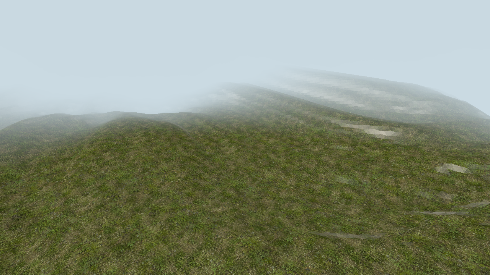
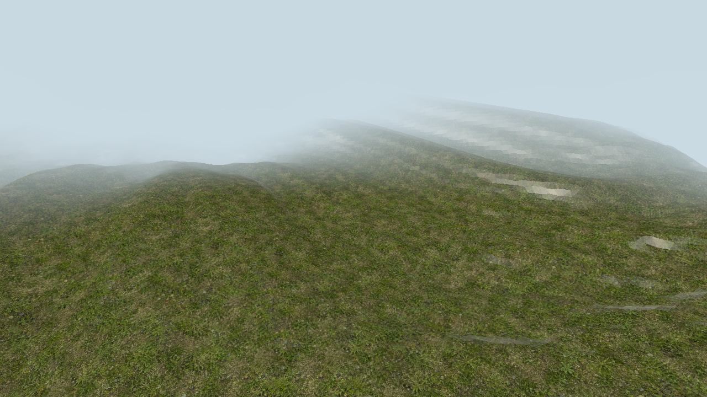
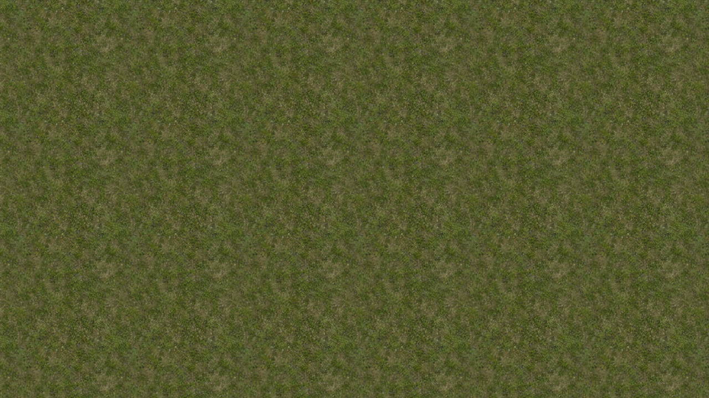
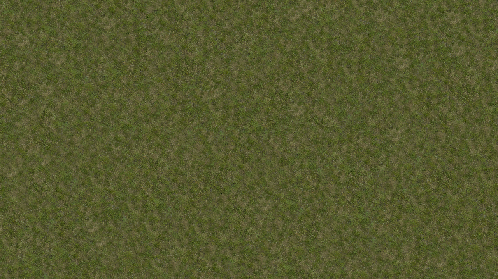

# metal-hex-tiling

A small, Metal-only Swift package for stochastic, non-repeating texture tiling on Apple GPUs.

[Project page](https://crapthings.github.io/metal-hex-tiling/) · [Algorithm and architecture](Documentation/Architecture.md) · [Measured performance](Documentation/Performance.md)

| Repeat sampling | Hex tiling |
| --- | --- |
|  |  |

The same seamless texture, terrain, camera, lighting, and UV scale—only the sampling method changes.

| Repeat sampling · top view | Hex tiling · top view |
| --- | --- |
|  |  |

The orthographic top view removes perspective, elevation, per-tile tint, and fog so the regular repetition grid—and its suppression by stochastic sampling—can be inspected directly.

## Why

Regular UV repetition preserves texture seams but exposes a visible grid of repeated features. MetalHexTiling samples the source texture at up to three deterministic random offsets and blends them over a triangular/hexagonal lattice. This breaks the repetition without generating geometry or storing a larger texture.

- Metal-only core; no MetalKit or AppKit dependency
- Explicit gradients for correct mip selection across patch boundaries
- Works with color, normal, roughness, and metalness maps
- Four runtime-tunable parameters in one 16-byte value

## Requirements

- macOS 13 or newer
- Swift 6 toolchain
- A Metal-capable GPU

The library depends on Metal, not MetalKit. It works with `MTKView`, `CAMetalLayer`, and offscreen renderers.

## Try it

Clone this repository, then run:

```sh
swift run -c release HexTilingDemo
```

The example includes its texture, generates mipmaps, and opens a terrain viewer. No asset downloads or Xcode project setup are needed.

- **Space** switches between repeat and hex sampling at the same effective texture scale.
- **T** switches between terrain and a flat top view.
- **C** toggles contrast correction; **[ / ]** adjusts patch scale.
- **WASD** moves, dragging looks around, and **R** resets the camera.

Controls stay visible in the window. The title shows current settings and whole-frame CPU/GPU timings (not an isolated tiling benchmark).

```sh
swift run HexTilingDemo --help
swift run HexTilingDemo --verify
swift run HexTilingDemo --verify --top-down-flat --snapshot /tmp/hex-tiling.png
```

## Installation

Add this package to `Package.swift`:

```swift
dependencies: [
    .package(
        url: "https://github.com/crapthings/metal-hex-tiling.git",
        branch: "main"
    )
]
```

Then add `.product(name: "MetalHexTiling", package: "metal-hex-tiling")` to your target dependencies.

The package currently tracks `main`. A semantic-version dependency will be documented with the first tagged release.

## Usage

Compile the packaged MSL implementation together with your application shader:

```swift
import MetalHexTiling

let library = try HexTilingMetal.makeLibrary(
    device: device,
    appending: applicationShaderSource
)

var arguments = HexTilingParameters(patchScale: 2).shaderVector
encoder.setFragmentBytes(
    &arguments,
    length: MemoryLayout<SIMD4<Float>>.stride,
    index: 1
)
```

Then call the sampling primitive from the appended MSL source:

```metal
fragment float4 materialFragment(
    VertexOut in [[stage_in]],
    constant HexTilingArguments &hex [[buffer(1)]],
    texture2d<float> colorMap [[texture(0)]]) {
    constexpr sampler repeatingSampler(coord::normalized, address::repeat,
                                        filter::linear, mip_filter::linear);
    float2 uvDx = dfdx(in.uv);
    float2 uvDy = dfdy(in.uv);
    return hexTilingSample(colorMap, repeatingSampler, in.uv, uvDx, uvDy, hex);
}
```

Input textures must be seamless and should include mipmaps. Use an sRGB pixel format for color maps and linear formats for normal, roughness, and metalness maps. Blended normal maps still need decoding and normalization in your material pipeline.

Contrast correction affects RGB only; alpha uses normalized weighted blending. For normal, roughness, and metalness maps, start with `useContrastCorrectedBlending: false`. If a texture has only one mip level, correction is automatically disabled because no coarse-mip mean is available. RGB is not clamped by the library; clamp bounded material data as needed before shading.

## Parameters

| Parameter | Default | Meaning |
| --- | ---: | --- |
| `patchScale` | `2` | Higher values create smaller stochastic patches. |
| `useContrastCorrectedBlending` | `true` | Preserves more local contrast during blending. |
| `lookupSkipThreshold` | `0.01` | Skips low-weight texture reads to reduce bandwidth. |
| `textureSampleCoefficientExponent` | `8` | Controls blend sharpness and how often reads can be skipped. |

Each map costs up to three regular texture samples per fragment. Contrast correction adds one lookup at the coarsest mip level. See [Algorithm and architecture](Documentation/Architecture.md) for implementation details and performance tradeoffs.

Skipped weights are renormalized, and the strongest sample is always kept—even at a threshold of `1`. This preserves constant input values while trading smooth transitions for fewer lookups.

## Development

```sh
swift test
```

Tests include actual GPU sampling for extreme weights, constant color/data, alpha, sRGB decoding, explicit mip selection, and single-mip fallback. GPU tests explicitly skip when Metal is unavailable; a successful CPU-only CI run does not establish GPU correctness.

The self-contained example lives in `Examples/Terrain`. Its `--verify` mode runs actual GPU rendering and readback, checking sampling/view switches, deterministic output, and terrain continuity. MetalKit is used only by the example target.

## License and attribution

Distributed under the MIT License. This port derives from `three-hex-tiling`; see [NOTICE](NOTICE) for upstream attribution and the Shadertoy provenance noted by upstream.
